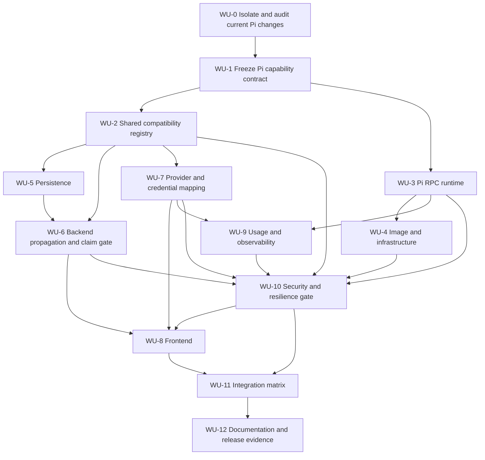

# Pi Coding Agent Integration Plan

Date: 2026-08-21
Status: Approved — adversarial planning gate passed
Delivery: One pull request, split into reviewable work-unit commits
Review mode: Receipt-driven development is disabled for this clone; ordinary repository policy applies

## 1. Outcome

Add Pi as a first-class Almirant `codingAgent` that can execute jobs with every AI provider and model combination that Pi genuinely supports.

The integration must keep these concepts independent:

| Concept | Responsibility |
| --- | --- |
| `provider` | Infrastructure and runner routing |
| `codingAgent` | Executable harness: Claude Code, Codex, OpenCode, or Pi |
| `aiProvider` | Credential and API family: Anthropic, OpenAI, Google, Z.AI, xAI, etc. |
| `model` | Exact model identifier selected for the job |

Selecting Pi must not silently rewrite the requested AI provider or model.

## 2. Current state

- Almirant currently supports `claude-code`, `codex`, and `opencode` as coding agents.
- Provider selection, AI-provider selection, and coding-agent selection are still coupled in several backend and frontend paths.
- A partial, uncommitted Pi runtime slice exists in the current dirty working tree. It includes a Pi RPC shim, runtime selection, image propagation, and related tests.
- That slice was produced without a trustworthy forensic handoff. It must be audited before any part is retained.
- The repository contains substantial unrelated work. Pi changes must be isolated before implementation continues.

## 3. Scope

### In scope

- Pi runtime adapter and container image.
- Provider-neutral authentication and model selection.
- Shared compatibility validation.
- Database, API, MCP, scheduled-agent, loop, and work-item propagation.
- Frontend coding-agent and model selection.
- Usage, token, cost, lifecycle, and error reporting.
- Regression coverage for existing coding agents.
- End-to-end smoke tests for every supported Pi provider family.

### Out of scope

- Claiming support for arbitrary provider/model strings.
- Silent fallback to another coding agent or model.
- Replacing the existing Claude Code, Codex, or OpenCode runtimes.
- Broad refactoring unrelated to runtime/provider separation.
- Shipping unsupported MCP, browser, subscription-auth, or read-only behavior as if it worked.

## 4. Architectural decisions

1. **Use a dedicated Pi runtime adapter.** Pi must not reuse OpenCode session semantics accidentally.
2. **Keep the four dimensions independent.** For modern jobs, `provider` is only an infrastructure lane and must not be derived from, or used to select, `codingAgent`, `aiProvider`, credentials, or `model`. `codingAgent` selects the executor. `aiProvider` plus a typed credential binding selects authentication, endpoint policy, and the adapter-specific Pi provider identifier. Adapter identifiers such as `piProvider` are resolved output, never free-form API input.
3. **Use one authoritative compatibility registry.** An environment-neutral `RuntimeCapabilityRegistry` solely admits `(codingAgent, aiProvider, model, authClass, capabilities)`, model defaults, and reasoning support, and returns typed rejection codes. API, scheduling, and runner admission import it directly. The frontend consumes a generated, versioned projection whose hash is enforced in CI. Secret names, concrete endpoints, headers, and CLI arguments remain infrastructure adapters that cannot admit combinations independently.
4. **Persist one immutable selection contract.** New writes resolve once into a complete, versioned `ResolvedRuntimeSelection`; explicit values are never rewritten, model IDs are opaque and case-preserving, and requested, resolved, and observed values remain distinguishable. Legacy inference and aliases live behind an anti-corruption adapter.
5. **Define “all models” precisely.** A model is supported only when the pinned Pi provider registry admits it and Almirant can safely supply the required authentication, endpoint, and capabilities.
6. **Fail closed before secrets or runner work.** Unsupported provider, authentication, MCP, browser, permission, read-only, model, endpoint, or runner-version combinations return typed errors before credentials are decrypted/exported or a runner claims the job.
7. **Prefer verified terminal aggregate usage.** When unavailable, use deduplicated final per-message totals; never sum streaming snapshots without proven semantics.
8. **Preserve existing behavior through explicit legacy resolution.** Existing defaults, aliases such as `codex-cli`, nullable rows, and persisted top-level/JSONB precedence remain covered by fixtures. Unknown explicit coding agents never fall back to another executor.
9. **Keep rollback boundaries independent.** Every work unit includes its tests and can be reverted independently. The database enum expansion is non-downgradable; application rollback disables Pi admission and drains or quarantines Pi jobs without removing the enum value.

## 5. Success criteria

- [ ] Pi appears on every coding-agent display surface, but is selectable only when the authoritative registry admits the surface's required capabilities.
- [ ] Capability-neutral API, scheduling, loop, MCP, and work-item paths preserve the immutable resolved selection unchanged; capability-dependent paths reject Pi before enqueue until a proven mechanism exists.
- [ ] The exact requested AI provider and model reach Pi without coercion, aliasing, or silent fallback.
- [ ] Every supported provider uses one typed credential bundle atomically bound to its authentication mode and trusted endpoint policy.
- [ ] Unsupported combinations, unadvertised runner versions, and unknown explicit coding agents are rejected before credentials are exported or a runner starts.
- [ ] Pi session creation, prompt execution, tool events, cancellation, process-group cleanup, and shutdown work deterministically.
- [ ] Terminal usage and cost reach the existing pipeline exactly once, or are explicitly unavailable.
- [ ] Pi has a reproducible, digest-pinned image with distinct liveness and readiness checks.
- [ ] Existing Claude Code, Codex, OpenCode, legacy aliases, persisted rows, and edit flows retain their behavior.
- [ ] At least one runtime smoke test passes for every enabled Pi provider family; disabled capability rows have typed rejection tests.
- [ ] Documentation states real capabilities, deployment order, rollback, and limitations without overclaiming.

## 6. Dependency map

## 7. Work units

### WU-0 — Isolate and audit the current Pi slice

**Goal:** establish a trustworthy baseline before retaining or editing any Pi code.

- [ ] Record the current repository state without staging or cleaning it.
- [ ] Create an isolated implementation workspace from the intended base revision.
- [ ] Inventory every Pi-specific untracked file.
- [ ] Identify tracked files changed by the partial Pi slice.
- [ ] Separate Pi edits from pre-existing edits in overlapping files.
- [ ] Exclude generated dependencies and local artifacts.
- [ ] Classify each Pi change as `keep`, `rewrite`, or `discard`.
- [ ] Produce a forensic manifest with source, purpose, and verification status.

**Exit evidence:** isolated candidate plus complete forensic manifest.
**Rollback:** remove the isolated workspace; do not alter the original dirty tree.

### WU-1 — Freeze the Pi capability contract

**Goal:** replace assumptions with an authoritative runtime contract.

- [ ] Pin the official Pi package, version, executable, and supported RPC/JSON mode.
- [ ] Freeze maximum inbound/outbound JSONL sizes, object schemas, response cardinality, partial-line EOF behavior, and `agent_settled` as the sole normal terminal.
- [ ] Document session creation, continuation, abort acknowledgement versus settlement, cancellation during tools, process lifetime, and shutdown semantics.
- [ ] Capture official event, tool-call, provider/model selection, and terminal usage shapes as machine-readable fixtures.
- [ ] Prove whether usage fields are terminal aggregates, deltas, snapshots, or per-message totals, including cache, reasoning, and cost semantics.
- [ ] Freeze a canonical authentication union (`api_key`, `setup_token`, provider-specific OAuth, subscription) and the minimum credential material each admitted mode requires.
- [ ] Confirm custom endpoint, header, environment-variable, and OpenAI-compatible behavior, including every Pi-recognized provider/endpoint override.
- [ ] Confirm MCP, extension, browser, permission, sandbox, and read-only boundaries.
- [ ] Freeze one persisted tuple for every candidate family: request → infrastructure provider lane → coding agent → AI provider → exact model → credential/endpoint identity.
- [ ] Audit existing persisted tuples, null/default rows, `codex-cli`, and top-level/JSONB mismatches before defining strict new-write validation.
- [ ] Produce the initial supported-provider matrix; unsupported capability/auth rows remain explicitly disabled.

**Exit evidence:** versioned capability document, persisted-tuple audit, and machine-readable protocol/auth/provider fixtures.
**Rollback:** documentation, audit output, and fixtures only.

### WU-2 — Centralize coding-agent compatibility

**Goal:** make runtime/provider/model validation consistent across the product.

Likely areas:

- `backend/packages/shared/src/agents/runtime-selection.ts`
- `backend/packages/shared/src/agents/scheduled-runtime-precedence.ts`
- `backend/packages/shared/src/agents/scheduled-connection-runtime.ts`
- `backend/packages/shared/src/agents/model-capabilities.ts`
- `backend/api/src/domains/agents/services/scheduled-agent-runtime-validation.ts`
- `services/runner/src/workspace/config-injector.ts`
- `frontend/src/domains/agents/domain/coding-agent-compatibility.ts`
- `frontend/src/domains/scheduled-agents/domain/types.ts`

Tasks:

- [ ] Add `pi` to the shared coding-agent type and define the sole `RuntimeCapabilityRegistry` owner.
- [ ] Define `RequestedRuntimeSelection` and immutable, versioned `ResolvedRuntimeSelection` with all four dimensions and resolution provenance.
- [ ] Resolve once at the application boundary; explicit fields remain exact and model IDs remain opaque and case-preserving.
- [ ] Define tuple-atomic versus fieldwise inheritance; validate a fieldwise result instead of rewriting it.
- [ ] Represent AI providers, provider-specific model validation, authentication classes, capabilities, defaults, reasoning support, and typed rejection reasons.
- [ ] Remove one-to-one assumptions and local admission/default maps from scheduling, validation, runner injection, and frontend code.
- [ ] Keep legacy inference, provider fallback for genuinely missing values, `codex-cli`, and persisted-row precedence in an explicit anti-corruption adapter.
- [ ] Reject any non-empty unknown coding agent; adapter-specific Pi provider IDs are derived output only.
- [ ] Generate a versioned frontend/REST/MCP/remote-agent projection and fail CI on registry hash drift.
- [ ] Add architecture tests that forbid compatibility/default maps outside the registry and modern executor dispatch by infrastructure provider.
- [ ] Add table-driven valid/invalid, capability, legacy, unknown-agent, and existing-runtime regression tests.

**Exit evidence:** API, scheduling, runner admission, and frontend parity tests consume the same registry version and preserve existing tuples.
**Rollback:** revert the registry and all consumers together while retaining the legacy adapter.

### WU-3 — Complete the Pi RPC runtime

**Goal:** provide a production-grade runtime adapter independent of OpenCode.

Likely areas:

- `services/runner/src/runtime-executors/pi.ts`
- `services/runner/src/runtime-executors/registry.ts`
- `services/runner/docker/pi-shim/`

Tasks:

- [ ] Audit the existing partial shim against WU-1 and spawn Pi with pinned, documented arguments.
- [ ] Require a complete resolved provider/model selection and fail if Pi's observed state differs.
- [ ] Implement one per-session/turn state machine for creation, prompt, tool lifecycle, settlement, abort, delete, and close.
- [ ] Use a byte-bounded incremental JSONL parser that rejects malformed, oversized, non-object, or unterminated records without logging raw payloads.
- [ ] Map text, reasoning, tool start/end, and exactly one idempotent terminal event; unresolved tools terminate as interrupted/failed, never successful.
- [ ] Preserve only an allowlisted, recursively sanitized, depth/size-bounded diagnostic projection of native Pi events.
- [ ] Handle stdin callback errors/EPIPE, every child close including code 0, request timeouts, startup exit, and partial output as typed session-poisoning failures.
- [ ] Mark settlement before dispatch, advance the queue from one path, and clear queued prompts on abort/delete/close.
- [ ] Distinguish abort acknowledgement from terminal settlement and invoke cancellation end-to-end from the runner consumer.
- [ ] Terminate the complete process group with bounded TERM/KILL escalation and wait for confirmed reaping before delete/close resolves.
- [ ] Reject unknown explicit coding agents; provider fallback is limited to missing legacy values.
- [ ] Add fixtures for chunk splits, missing newlines, malformed/null/oversized records, duplicate settlement, EPIPE, early exit, queued cancellation, tool interruption, and process cleanup.

**Exit evidence:** focused shim tests prove deterministic success, cancellation, one terminal, bounded failure, and zero surviving process-group members.
**Rollback:** remove Pi executor registration and shim package; explicit unknown-agent rejection remains.

### WU-4 — Build and distribute the Pi runtime image

**Goal:** make the runtime reproducible in local and cloud execution.

Likely areas:

- `services/runner/docker/Dockerfile.pi`
- `config/shim-images.json`
- `services/runner/src/shared/config.ts`
- `services/scaler/src/`
- `services/updater/src/`
- Compose and image-publication workflows

Tasks:

- [ ] Pin the Pi package and base image by immutable version and digest.
- [ ] Run as a non-root user with explicit writable paths and workspace policy.
- [ ] Add separate `/health/live` and `/health/ready` endpoints, a Docker `HEALTHCHECK`, and an entrypoint that rejects listen failures.
- [ ] Make readiness false and stop request admission before bounded socket/SSE draining and adapter shutdown.
- [ ] Propagate the image through runner, scaler, updater, local Compose, production Compose, and static-runner configuration.
- [ ] Add image build/publication CI and image-contract tests.
- [ ] Build the image and verify the pinned Pi RPC contract with a minimal container smoke test.
- [ ] Define rolling deployment order: claim gate first, then Pi-capable runners/scaler, then Pi-producing API/UI admission.

**Exit evidence:** digest-reproducible image build, liveness/readiness behavior, and container RPC smoke test.
**Rollback:** disable Pi admission, drain or quarantine Pi jobs, and remove the image publication target without removing the claim gate.

### WU-5 — Persist Pi as a coding agent

**Goal:** store Pi without invalidating existing data.

Likely areas:

- `backend/packages/database/src/schema/enums.ts`
- Agent-job, loop, work-item, and native-event schemas
- Database migration journal and generated migration
- `backend/packages/remote-agent/src/client/types.ts`

Tasks:

- [ ] Decide the canonical infrastructure-provider lane for every Pi provider family; no family may use a placeholder legacy provider.
- [ ] Add `pi` through an isolated, expand-only `ALTER TYPE ... ADD VALUE 'pi'` migration generated from the WU-0 candidate.
- [ ] Assert generated SQL contains no unrelated schema changes, enum replacement, or row updates.
- [ ] Update every persisted coding-agent and resolved-selection union while preserving existing defaults, nullability, and aliases.
- [ ] Define modern versus legacy top-level/JSONB precedence and keep old rows readable.
- [ ] Update remote-agent request/response contracts with the immutable resolved selection and typed credential binding identity.
- [ ] Add pre-migration/default/null/legacy fixtures and Pi round-trip tests across jobs, loops, work items, and native events.

**Exit evidence:** old rows remain readable, defaults are unchanged, and complete Pi selections round-trip.
**Rollback:** the enum expansion is non-downgradable; application rollback leaves `pi` in the enum, disables admission, and drains or quarantines Pi jobs without rewriting existing values.

### WU-6 — Propagate Pi through backend execution flows

**Goal:** ensure every execution path preserves the selected coding agent.

Subtasks:

- [ ] Agent and scheduled-agent create/update/run-now validation resolves and persists one complete selection.
- [ ] Capability-neutral loop, work-item, backlog, DoD/remediation, release-integration, webhook, and MCP transports preserve that selection.
- [ ] Capability-dependent paths reject Pi before enqueue when MCP, browser, permission-enforced, or read-only support is not proven.
- [ ] Worker claims advertise the exact supported coding-agent set on every request.
- [ ] Pi jobs are claimable only when `pi` is explicitly advertised; absent/empty advertisements retain broad legacy claiming only for Claude Code, Codex, and OpenCode.
- [ ] Capability and auth admission runs before provider-key lookup, credential decryption, or export and is repeated at runner entry as defense in depth.
- [ ] Split delivery into reviewable slices: general enqueue/claim; scheduled/webhook; backlog/DoD/release; loops/work-items; MCP parity.

Capability-neutral subtasks require a positive Pi propagation case. Capability-dependent subtasks require typed pre-enqueue rejection until WU-10 proves support. Every slice also needs an unsupported-combination case, old-runner simulation, unknown-agent rejection, and existing-runtime regression.

**Exit evidence:** API-to-runner tests preserve the versioned resolved selection, mixed-version runners fail closed, and unsupported capabilities never export credentials.
**Rollback:** disable Pi admission and drain/quarantine Pi jobs while preserving the claim gate and existing payload compatibility.

### WU-7 — Add provider-neutral credentials and model mapping

**Goal:** support every provider family Pi and Almirant can safely combine.

Before enabling any family:

- [ ] Replace flat/shared provider-key output with one typed credential bundle atomically bound to canonical provider ID, exact auth mode, trusted endpoint policy/origin, credential, and admitted models.
- [ ] Resolve and export only the one bundle requested by the job; never export unrelated refresh tokens, ID tokens, or provider credentials.
- [ ] Reserve and reject job environment variables that can override Pi provider, endpoint, auth, config, or model selection.
- [ ] Apply safe outbound request policy to authenticated probes: HTTPS/public DNS, redirect revalidation, no userinfo/query secrets, bounded responses, and header-based Google authentication.
- [ ] Validate a preferred connection strictly and scope connection suspension/exclusion to the same job, workspace, provider, and claim.

Implement and verify each provider independently:

#### WU-7A — Anthropic

- [ ] Map Anthropic credentials.
- [ ] Preserve exact model identifiers.
- [ ] Verify one Pi RPC smoke test.

#### WU-7B — OpenAI and Codex models

- [ ] Map only evidenced OpenAI API-key credentials.
- [ ] Confirm Codex-family model identifiers supported by Pi.
- [ ] Preserve provider-specific OAuth/setup-token/subscription modes as distinct typed values and reject unsupported Pi modes before export.
- [ ] Verify reasoning configuration where supported.
- [ ] Verify one Pi RPC smoke test.

#### WU-7C — Google

- [ ] Remove current top-level validation gaps only where required.
- [ ] Map Google credentials and provider identifiers.
- [ ] Verify one Pi RPC smoke test.

#### WU-7D — xAI/Grok

- [ ] Confirm native or OpenAI-compatible Pi configuration.
- [ ] Map endpoint, credentials, and model identifiers.
- [ ] Verify one Pi RPC smoke test.

#### WU-7E — Z.AI/GLM

- [ ] Confirm native or OpenAI-compatible Pi configuration.
- [ ] Map endpoint, credentials, and model identifiers.
- [ ] Verify one Pi RPC smoke test.

#### WU-7F — Custom OpenAI-compatible providers

- [ ] Use a typed, instance-admin-managed connection/profile ID rather than a free-form URL/provider string in job input.
- [ ] Keep custom providers disabled unless the origin is explicitly trusted, headers remain encrypted, redirects are revalidated, and egress policy enforces the boundary.
- [ ] Validate URL scheme, public DNS resolution, resolved IPs, redirects, userinfo, query credentials, required headers, and model/API compatibility.
- [ ] Prevent credentials from crossing provider or endpoint boundaries and reject environment-based overrides.
- [ ] Add negative tests for SSRF, redirects, embedded secrets, untrusted origins, cross-provider credentials, and incomplete configuration.

**Exit evidence:** one verified matrix row per enabled provider family, each backed by a typed credential/endpoint bundle.
**Rollback:** disable one provider mapping without disabling Pi globally.

### WU-8 — Add Pi to the frontend

**Goal:** expose only combinations the backend will accept.

Likely areas:

- Scheduled-agent and loop forms
- Project AI configuration
- Provider/model selectors
- Agent lists, session tables, and filters
- Provider icons
- `frontend/messages/en.json`
- `frontend/messages/es.json`

Tasks:

- [ ] Add Pi to coding-agent domain types.
- [ ] Add Pi labels, descriptions, and icon treatment.
- [ ] Add Pi to agent and loop forms.
- [ ] Filter AI providers through the compatibility registry.
- [ ] Filter models through the selected Pi provider.
- [ ] Display typed incompatibility reasons.
- [ ] Preserve the raw persisted runtime tuple while editing, including unknown, future, legacy, null/default, and currently unsupported values.
- [ ] Render unsupported retained selections explicitly and omit runtime fields from PATCH unless the user changes them.
- [ ] Never clear an existing model/provider merely because current filtering would not offer it.
- [ ] Add component/hook tests for Pi, `codex-cli`, synthetic future agents, unrelated edits, and existing coding agents.

**Exit evidence:** the UI cannot submit a newly invalid combination and cannot silently rewrite an existing or unknown selection.
**Rollback:** hide new Pi selection while retaining display/edit preservation for persisted values.

### WU-9 — Persist usage, cost, and observed runtime data

**Goal:** make Pi jobs measurable and auditable.

- [ ] Implement WU-1 usage precedence: verified terminal aggregate first, otherwise deduplicated final per-message totals, never streaming-snapshot summation.
- [ ] Add turn/event identity and exactly-once terminal/usage handling; duplicate settlement is idempotent.
- [ ] Map input, output, cache, reasoning, total tokens, and provider cost when available.
- [ ] Fail unexpected EOF when no valid terminal was observed.
- [ ] Record requested, resolved, and observed coding agent, AI provider, and exact model; retain infrastructure provider separately as routing evidence.
- [ ] Propagate all supported usage fields through runner completion payloads without dropping cache/reasoning.
- [ ] Add fixture → runner → persistence replay/dedup tests and explicit `unknown` behavior when Pi omits usage or cost.

**Exit evidence:** fixture event → runner result → persisted metrics exactly once, with requested/resolved/observed selection evidence.
**Rollback:** Pi execution remains possible with metrics explicitly unavailable, never fabricated.

### WU-10 — Harden permissions and failure semantics

**Goal:** prevent capability drift and silent unsafe degradation.

- [ ] Reject Pi before enqueue when any MCP field/profile, browser request/marker, or read-only/permission-enforced intent is present unless a documented mechanism proves the boundary.
- [ ] Enforce container filesystem/workspace policy independently of Pi's tool allowlist.
- [ ] Preserve canonical auth classes and reject unsupported setup-token, OAuth, or subscription modes before decryption/export.
- [ ] Recursively sanitize and size/depth-bound events before the shim boundary; redact commands, configuration, headers, URLs, environments, and logs.
- [ ] Do not persist token prefix/suffix fragments; use connection IDs or keyed fingerprints.
- [ ] Bound JSONL, SSE backpressure, retries, request timeouts, queue depth, shutdown, and process-group reaping.
- [ ] Classify authentication, model, endpoint, protocol, process, cancellation, usage, and policy failures.
- [ ] Scope preferred/excluded/suspended connections to the same job, workspace, provider, and claim.
- [ ] Verify cancellation during tools with queued prompts, malformed/oversized events, slow consumers, cross-workspace no-mutation, and zero orphan processes.

**Exit evidence:** negative security and resilience tests fail closed before credential export and leave no leaked data or processes.
**Rollback:** disable the affected Pi capability rather than relaxing policy.

### WU-11 — Run the integration matrix

**Goal:** prove behavior at runtime boundaries, not only through unit tests.

For every supported provider family, verify:

- [ ] Container liveness/readiness, session creation, exact resolved/observed provider and model, streaming, and one represented tool call.
- [ ] Cancellation during a tool with queued work reaches one terminal and reaps the process group.
- [ ] Invalid credentials, untrusted endpoints, unsupported auth/models/capabilities, and unknown agents fail before execution or credential export with the expected typed class.
- [ ] Terminal usage is captured exactly once or explicitly unavailable.
- [ ] Container/session cleanup completes after success, malformed/null/oversized JSONL, partial EOF, EPIPE, clean/nonzero early exit, request timeout, slow SSE, and duplicate settlement.
- [ ] Custom endpoint negative cases cover SSRF, redirects, embedded secrets, environment overrides, and cross-provider credential isolation.

Also verify absent/empty/legacy/Pi runner-claim matrices, old-runner simulation, rolling deployment order, edit preservation, and Claude Code, Codex, and OpenCode smoke paths. Disabled MCP/browser/read-only rows require rejection evidence rather than false-positive execution.

**Exit evidence:** provider/capability matrix report with exact commands, versions, credentials class, and outcomes.
**Rollback:** disable only failing Pi rows, drain/quarantine queued Pi jobs, and retain the mixed-version claim gate.

### WU-12 — Document and prepare release evidence

**Goal:** make the feature operable after merge.

- [ ] Document how to select Pi.
- [ ] Document provider and model support.
- [ ] Document required credentials.
- [ ] Document unsupported capabilities and failure behavior.
- [ ] Document local and cloud image configuration.
- [ ] Add troubleshooting for authentication, model, RPC, and process failures.
- [ ] Record expand-only migration behavior, claim-gate-first deployment order, admission flags, draining/quarantine, and non-downgradable database rollback semantics.
- [ ] Produce the final test, security, migration, mixed-version, and runtime evidence summary.

**Exit evidence:** operators can configure, deploy, diagnose, disable, and roll back Pi without reading source code.

## 8. Adversarial planning gate

Implementation must not start until the frozen plan is independently challenged through these four lenses:

| Lens | Questions |
| --- | --- |
| Architecture | Does the plan genuinely remove runtime/provider coupling? Is there more than one source of compatibility truth? |
| Security | Can credentials cross endpoints, leak through logs, or be injected into untrusted custom-provider configuration? |
| Reliability | Can Pi leave orphaned processes, lose terminal usage, hang cancellation, or misclassify partial RPC output? |
| Regression | Can migrations, defaults, or validation changes break existing Claude Code, Codex, or OpenCode jobs? |

### Review protocol

1. Freeze this plan revision.
2. Give each critic the same plan and repository mapping independently.
3. Require evidence-backed findings and concrete affected work units.
4. Separate blocking defects from recommendations.
5. Consolidate all valid findings into one correction pass.
6. Re-check only the corrected areas.
7. Record the final planning verdict before WU-0 implementation begins.

### Initial verdicts and consolidated correction

| Lens | Initial verdict | Blocking themes incorporated |
| --- | --- | --- |
| Architecture | REVISE | Infrastructure/provider semantics, authoritative registry ownership, immutable requested/resolved/observed selection, capability-aware propagation, WU-10 dependency gate |
| Security | REVISE | Atomic credential/endpoint bundles, SSRF and redirect policy, auth-mode preservation, pre-decryption admission, sanitized bounded diagnostics, scoped connection mutation |
| Reliability | REVISE | Fail-closed bounded JSONL, one terminal state machine, queue-safe cancellation, process-group reaping, usage authority, liveness/readiness |
| Regression | REVISE | Mixed-version claim gate, explicit legacy resolution, expand-only enum migration, old-row/default fixtures, edit preservation |

One correction pass updated sections 4–7, 9–12. Only these corrected areas were re-checked.

| Lens | Targeted re-check | Result |
| --- | --- | --- |
| Architecture | Four dimensions, one registry, immutable selection, capability gate | PASS |
| Security | Credential/endpoint binding, auth admission, capability rejection, diagnostics, connection scope | PASS |
| Reliability | Bounded protocol, lifecycle/queue, cancellation/reaping, usage, health/shutdown | PASS |
| Regression | Mixed-version claims, persisted tuple, legacy rows, migration, edit preservation | PASS |

Final planning verdict: **PASS**. WU-0 may begin; no product implementation may bypass its isolation and forensic-exit evidence.

## 9. Known risks and mitigations

| Risk | Mitigation |
| --- | --- |
| Dirty working tree mixes unrelated changes | WU-0 isolates and inventories before edits |
| “All models” becomes an unsafe wildcard | Authoritative provider/model registry with fail-closed validation |
| Frontend and backend compatibility drift | Shared/generated contract plus parity tests |
| Provider credentials reach the wrong endpoint | Explicit provider binding and negative credential-boundary tests |
| Pi RPC differs from assumptions in the partial slice | WU-1 freezes primary-source protocol evidence before runtime work |
| Usage is undercounted or duplicated | Prefer terminal aggregates and test replay deduplication |
| Existing agents regress | Every work unit includes existing-runtime regression coverage |
| Unsupported MCP/browser behavior is silently degraded | Typed capability rejection before runner launch |
| Container cannot be reproduced | Digest-pinned base and Pi package, health contract, image test, and RPC smoke test |
| Old runner claims a Pi job | Claim gate requires explicit `pi` advertisement before Pi admission |
| Auth material or SSRF crosses a provider boundary | Atomic typed credential/endpoint bundle, safe outbound policy, and pre-decryption admission |
| Enum rollback corrupts Pi rows | Expand-only migration remains in place; application rollback disables and drains Pi |

## 10. Commit plan

The change will use one pull request with work-unit commits. Tests belong in the same commit as the behavior they verify.

Suggested commit sequence:

1. `test(pi): freeze runtime and legacy-selection fixtures`
2. `refactor(agents): centralize runtime capability admission`
3. `feat(agents): gate coding-agent claims by runner support`
4. `feat(runner): add deterministic Pi RPC runtime`
5. `feat(infra): distribute the pinned Pi runner image`
6. `feat(database): persist Pi coding agent and resolved selection`
7. Reviewable backend propagation slices from WU-6
8. One commit per verified provider family
9. `feat(frontend): expose capability-aware Pi selection`
10. `feat(runner): persist Pi usage and observed runtime`
11. `test(pi): cover security, resilience, and provider matrix`
12. `docs(pi): document configuration and operations`

The repository-wide size exception is pre-approved, but the implementation must still remain reviewable by work unit.

## 11. Implementation entry checklist

- [x] This plan has a completed adversarial verdict.
- [ ] WU-0 has a safe isolation strategy.
- [ ] The intended base revision is known.
- [ ] The partial Pi slice has a complete forensic manifest.
- [ ] The Pi version and RPC contract are pinned.
- [ ] Provider support is defined by evidence, not assumptions.
- [ ] Verification commands and runtime credentials are available for enabled providers.
- [ ] No implementation task depends on modifying the unrelated dirty working tree.

## 12. Definition of done

The integration is complete only when:

1. Every success criterion in section 5 passes.
2. Every enabled provider has runtime evidence.
3. Existing coding agents retain their behavior.
4. Database migration and rollback evidence exist.
5. Security and resilience negative tests pass.
6. Documentation matches the final compatibility matrix.
7. The final candidate follows ordinary repository policy with RDD reported as `disabled/unmanaged`.
